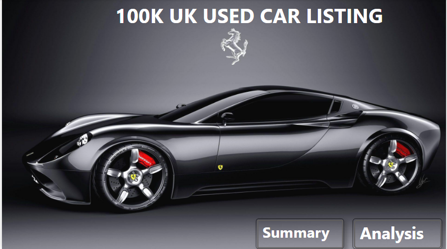

# UK-USED-CAR-LISTING

--------
## Introductions
This project involves analyzing scraped data from used car listings, with up to 100,000 entries. The dataset includes information on price, transmission, mileage, fuel type, road tax and model 

Dataset Used : Data Sourced from Kaggle https://www.kaggle.com/datasets/adityadesai13/used-car-dataset-ford-and-mercedes

-----------
## Skills Implemented
* Data Cleaning and Transformation

* Data Modelling

* Data Visualization

## Tool Used
Power Bi

-------------
## Problem Statement
What are the key factors that influence the selling price of cars, and how do they relate to each other?

How can car manufacturers, sellers, and buyers use this information to make informed decisions about pricing and purchasing?

------------
## Data Cleaning and Transformation
* I Imported the data into Power Query in Power BI using a folder connector.
  
* Ensured data accuracy and reliability through extensive cleaning and manipulation.
  
* I Removed entries with errors, specifically those related to the "unclean CClass" and "unclean Focus," resulting in 11 distinct car manufacturers

*Removed duplicate records, leaving 106,259 unique entries.

* Created a new column for the “Age of the car” by converting the year into days and then into years.
