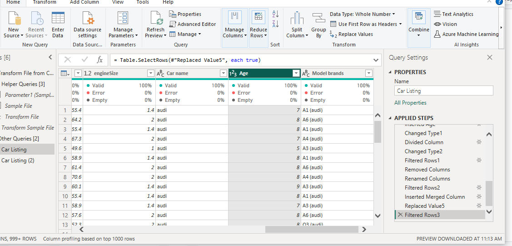
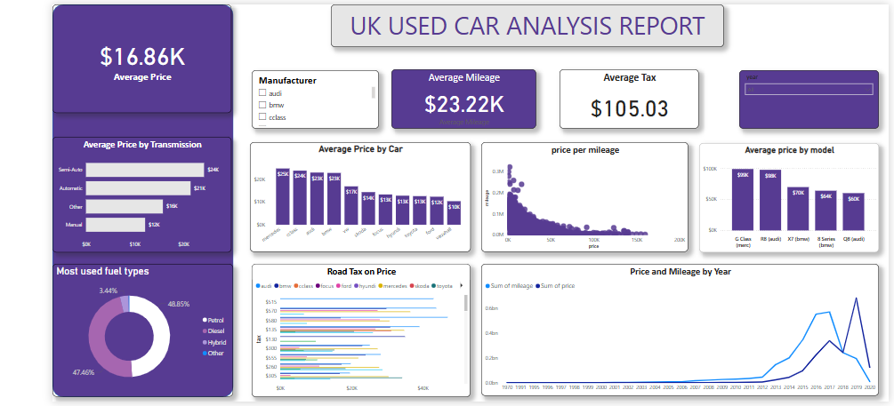
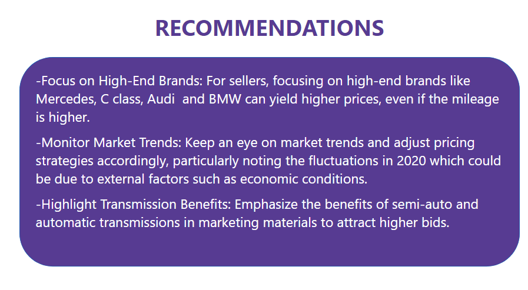

# UK-USED-CAR-LISTING

--------
## Introductions
This project involves analyzing scraped data from used car listings, with up to 100,000 entries. The dataset includes information on price, transmission, mileage, fuel type, road tax and model 

Dataset Used : Data Sourced from Kaggle https://www.kaggle.com/datasets/adityadesai13/used-car-dataset-ford-and-mercedes

-----------
## Skills Implemented
* Data Cleaning and Transformation

* Data Modelling

* Data Visualization

## Tool Used
Power Bi

-------------
## Problem Statement
What are the key factors that influence the selling price of cars, and how do they relate to each other?

How can car manufacturers, sellers, and buyers use this information to make informed decisions about pricing and purchasing?

------------
## Data Cleaning and Transformation
* I Imported the data into Power Query in Power BI using a folder connector.
  
* Ensured data accuracy and reliability through extensive cleaning and manipulation.
  
* I Removed entries with errors, specifically those related to the "unclean CClass" and "unclean Focus," resulting in 11 distinct car manufacturers

* Removed duplicate records, leaving 106,259 unique entries.

* Created a new column for the “Age of the car” by converting the year into days and then into years
  

  -----------------
  ## Data Modelling
*  I Created a column for "Price per Model" using the formula: Car listing(Price) / Car listing(Mileage).
  
* I Created new measures using DAX:
  
 Average price: AVERAGE(Price)

Average tax: AVERAGE(Tax)

Average Mileage: AVERAGE(Mileage)
.png)

----------
## Findings
### Average Price by Car

Mercedes has the highest average price at $24.6k followed by C class at €23.7k

Mainstream brands like Vauxhall,Ford,Toyota have lower average price, around €10k-€14k

### Average Price by Model

The top 5 car models with the highest average prices are:
1. G Class - Mercedes: €99,000
2. R8 - Audi: €98,000
3. X7 - BMW: €70,000
4. 8 Series - BMW: €64,000
5. Q8 - Audi: €60,000

### Most used Fuel types

Petrol is the most common fuel type, used in 48.85% of cars.

Diesel is close behind, used in 47.46% of cars.

Hybrid cars are much less common, representing only 3.44% of the sample.

### Average Price by Transmission

From the analysis, it is evident that semi-automatic and automatic cars command the highest average prices, significantly surpassing those of other transmission types. This reflects a market preference for vehicles with more advanced and convenient transmission systems.

### Price and Mileage by Year

Over the years, both price and mileage showed an increasing trend. However, there was a decline in price in 2020 and a drop in mileage from 2019 to 2020.

### Correlation between Price and Mileage

The scatter plot indicates a positive correlation between mileage and price, showing that as mileage decreases, the price tends to increase

From our analysis, the primary factors influencing the selling price of used cars in the UK are transmission type, car brand and model, mileage, age,  and fuel type.

### Analysis report contains two pages
Welcome Page                   |                                      Analysis                                
:------------------------------|-----------------------------------------------:         
          |                                    

### You can interact with the report [here](https://app.powerbi.com/groups/me/reports/489b83a4-3b99-446b-a4d2-851ef136b9de/ReportSection?experience=power-bi)

By understanding and leveraging these insights, all stakeholders in the used car market can make informed, strategic decisions that enhance value, optimize pricing, and improve purchasing outcomes.

  
